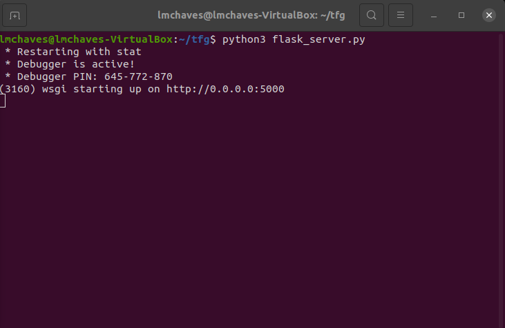
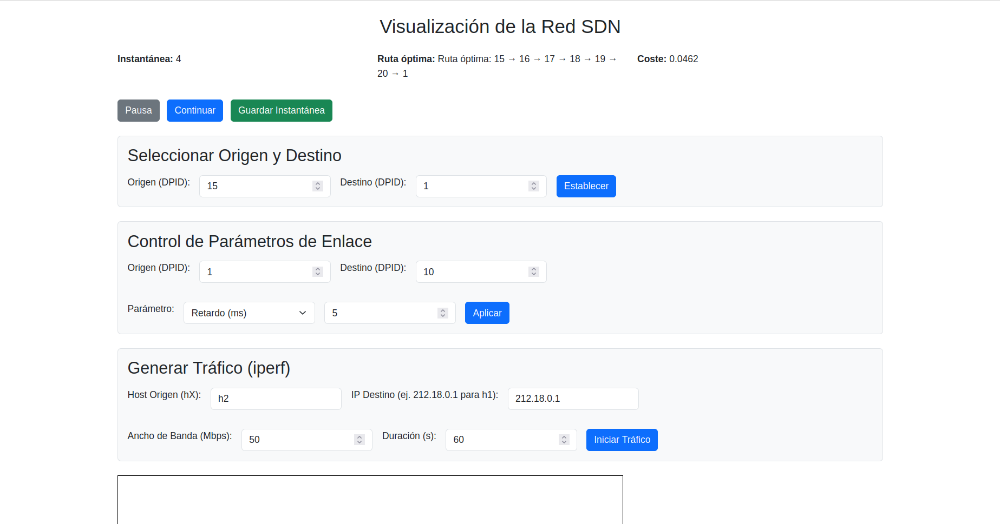
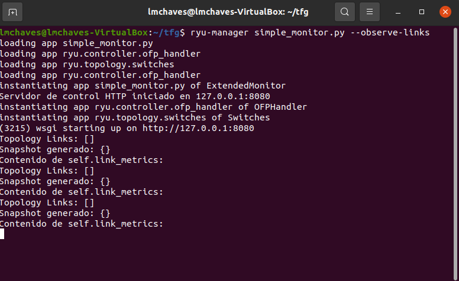
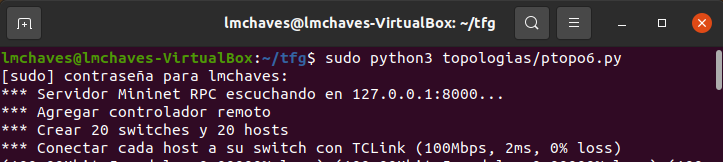

## Manual de usuario

### Introducción

El proyecto creado para la optimización del balanceo de carga por medio de algoritmos bioinspirados requiere una serie de pasos e instrucciones para poder lanzar correctamente la aplicación web y poder interactuar con la red SDN.

A fin de ejecutar correctamente la aplicación, es necesario seguir una serie de pasos y disponer de un entorno previamente configurado. Todos los archivos necesarios para su implementación y uso se encuentran disponibles en el siguiente repositorio de GitHub:  
[https://github.com/lmchaves/tfg](https://github.com/lmchaves/tfg)

### Requisitos y herramientas necesarias

Antes de descargar los archivos necesarios, es imprescindible contar con **Mininet** y el controlador **Ryu** instalados en el sistema.

Existen diversas formas de realizar la instalación. En este caso, se ha seguido un procedimiento sencillo y práctico, explicado en el siguiente video:  
[https://www.youtube.com/watch?v=q4wsx4u5juU&list=LL&index=5](https://www.youtube.com/watch?v=q4wsx4u5juU&list=LL&index=5)

### Guía de uso de la aplicación

#### 1. Clonar el repositorio

Abre una terminal y ejecuta los siguientes comandos:

```bash
git clone https://github.com/lmchaves/tfg
cd tfg
```

Una vez clonado el repositorio, nos situamos en el directorio y procedemos a abrir **tres terminales independientes**.

---

#### 2. Ejecutar la aplicación web

En la **primera terminal**, ejecutamos el siguiente comando:

```bash
python3 flask_server.py
```

Esto iniciará el servidor web y nos mostrará la dirección de la aplicación, como se observa en la siguiente imagen:

> 

Solo es necesario copiar dicha dirección en el navegador para visualizar la interfaz general de la aplicación:

> 

---

#### 3. Iniciar el controlador Ryu

En la **segunda terminal**, iniciamos el controlador de Ryu mediante el siguiente comando:

```bash
ryu-manager simple_monitor.py --observe-links
```

Esto activará el controlador como se muestra a continuación:

> 

---

#### 4. Lanzar la topología en Mininet

Finalmente, en la **tercera terminal**, lanzamos la topología utilizando permisos de superusuario:

```bash
sudo python3 topologias/ptopo6.py
```

La ejecución correcta se puede ver en la siguiente imagen:

> 